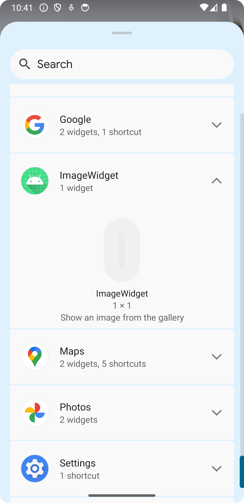
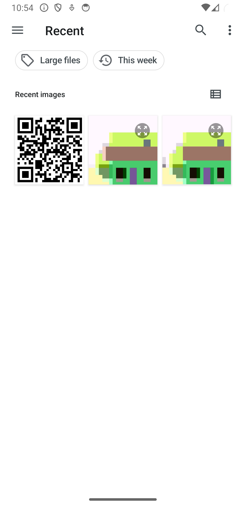
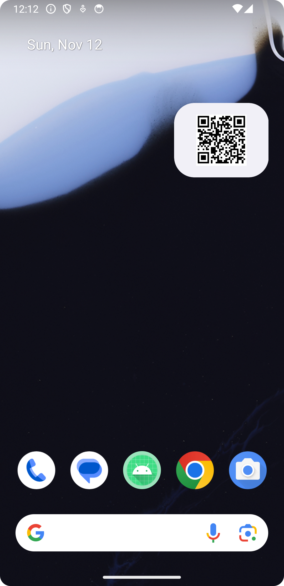

# Image Display Widget for Android

(CC) 2023 by Andreas Frisch <github@fraxinas.dev>

## OwO what's this?
**`imagewidget` is an app that shows a gallery image in a widget on the Android home screen**

## Features
* Appears in widget list, can be dragged to home screen
* Gallery image selection
* Resizable widget

## Screenshots
|  |  |  |
|:--------------------------| :---------------------------- |:-------------------------------------|

## Compatibility
* Android 7.0 Nougat +

## Disclaimer
* This is my first ever Android app, don't consider it production ready
